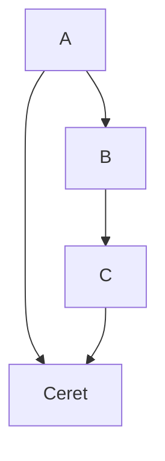

```
bacalhau docker run \  
-v QmTr26AJDQMyxEJacL2ph7N71SAgRJaqj4USt4bMiE4Jff:/inputs/test.png  
ghcr.io/openlab-apps/vahadane_norm_and_tile:main 'python main.py /inputs/test.png'
```


>  Here's a callout block. 
>  It supports **markdown** and [[Internal link|wikilinks]].


