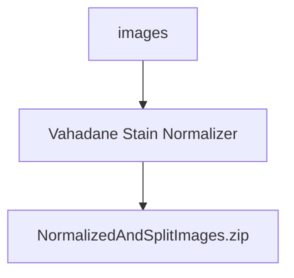

# Vahadane Stain Normalization and Tiling
[github](https://github.com/openlab-apps/vahadane_norm_and_tile), [pdf](https://ieeexplore.ieee.org/stamp/stamp.jsp?arnumber=7460968)

[](https://github.com/openlab-apps/vahadane_norm_and_tile/actions/workflows/docker-publish.yml)

---
## Visual Abstract

![[Screen Shot 2022-12-05 at 3.42.22 PM.png]]

## Introduction

Pathology slides have a significant amount of variation between them. This may arise from different staining protocols, imaging or scanning techniques. This protocol will normalize images to make them easier to read by pathologists, and more importantly, software, while still maintaining the structure of the image. 

Vahadane Stain Normalization is one of the most popular preprocessing methods in digital pathology. As stated in the paper, **"this normalizer is a solution for stain separation and color normaization, which preserves biological structure information by modelling stain density maps"**

The image is first decompsed to create stain density maps. Then, the maps are combined with a basis of a pathologist-preferred target image thus creating the final outputted image. This method will only alter the image's color while still preserving the structure.

## Process


## Input

Pathology images will be passed into the API, then will be split into 8 tiles (feature added soon to dynamically change this). Each image will then be passed in to the Vahadane Stain Normalization algorithm (learn more [here](https://ieeexplore.ieee.org/stamp/stamp.jsp?arnumber=7460968)) (feature added soon to dynamically change the stain algorithm used). 

## Important Parameters

(Currently in the process of integrating) 

We will be adding the parameter of changing the number of slices of the output image. Currently, we have 8 vertical slices by default, but will make this customizable to change the number and orientation of the slices.

## Output
After being processed through the Vahadane Stain Normalization Algorithm, the images will then be zipped and sent in a file titled ```normalizedAndSplitPictures.zip```. Check out [```main.py```](https://github.com/openlab-apps/vahadane_norm_and_tile/blob/main/main.py) for more details

We have 3 images in the ```images/``` directory where you can test out the container. We also have the files on Bacalhau, which you can learn more about [here](#Processing-data-with-bacalhau). 

## Access

There are multiple ways to use this application. To do any of this you must first clone the repository by running ``git clone https://github.com/labdao-apps/vahadane-norm.git`` in your terminal.

### Running this app locally
Run the app locally with: `uvicorn main:app --reload --host "0.0.0.0"`

### Building the container image

1. Clone this repository
2. Inside the directory for this repository, run:

    ```
    docker build -t vahadane_norm_and_tile .
    ```

### Running the container
Run the app in Docker via:

    docker run -d -p 8000:8000 vahadane_norm_and_tile:latest

and it should be running at http://localhost:8000 (or replace `localhost` with the IP/DNS name of whichever computer is running the container)

### Processing data with bacalhau 
You can learn more about [[bacalhau]] in the [docs](https://docs.bacalhau.org/getting-started/installation).

the examples images have been pinned to IPFS using Pinata:
```
QmTr26AJDQMyxEJacL2ph7N71SAgRJaqj4USt4bMiE4Jff
QmX4kSU5W5Lnjjx9ZhBezonMdKQiy3zbJfkSLfUE4cTDMd
QmQr9LBQhmCUzRXkZZeN5nVZriavubLpBffFv5WkBFNUFU
```

Install bacalhau via: 
```
curl -sL https://get.bacalhau.org/install.sh | bash
```

To process the first of the example images using bacalhau, run: 
```
bacalhau docker run \                                         
  -v QmTr26AJDQMyxEJacL2ph7N71SAgRJaqj4USt4bMiE4Jff:/inputs/test.png \
  ghcr.io/openlab-apps/vahadane_norm_and_tile:main python main.py /inputs/test.png 
```

You can download the results by calling ``` bacalhau get ``` on the job id you have received.

## Benchmark

coming soon

## Citation
```
@ARTICLE{7460968,  author={Vahadane, Abhishek and Peng, Tingying and Sethi, Amit and Albarqouni, Shadi and Wang, Lichao and Baust, Maximilian and Steiger, Katja and Schlitter, Anna Melissa and Esposito, Irene and Navab, Nassir},  journal={IEEE Transactions on Medical Imaging},   title={Structure-Preserving Color Normalization and Sparse Stain Separation for Histological Images},   year={2016},  volume={35},  number={8},  pages={1962-1971},  doi={10.1109/TMI.2016.2529665}}
```


