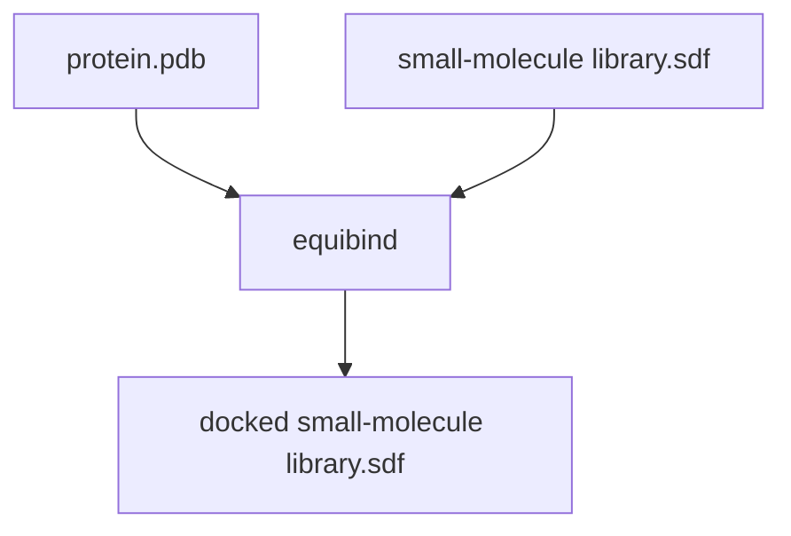

# Equibind
[github](https://github.com/openlab-apps/equibind), [pdf](https://arxiv.org/pdf/2202.05146.pdf), [talk](https://www.youtube.com/watch?v=JAvh9e6XEGM)

## Visual Abstract
![[Pasted image 20220929153838.png]]

## Introduction
*coming soon*

## Process


## Input
*coming soon*


## Important Parameters
*coming soon*

## Output
*coming soon*

## Benchmark 
*coming soon*

## Access
Run on [[bacalhau]]
```
bacalhau docker run \  
-v QmTr26AJDQMyxEJacL2ph7N71SAgRJaqj4USt4bMiE4Jff:/inputs/test.png  
ghcr.io/openlab-apps/vahadane_norm_and_tile:main 'python main.py /inputs/test.png'
```

Run locally
```
docker pull ghcr.io/openlab-apps/equibind:main
```

## Contact
[equibind maintainer chat](https://t.me/+3Mu6kERdgKgyNTAy)
[author](https://twitter.com/HannesStaerk)


## Citation
```
@article{https://doi.org/10.48550/arxiv.2202.05146,
  doi = {10.48550/ARXIV.2202.05146},
  
  url = {https://arxiv.org/abs/2202.05146},
  
  author = {Stärk, Hannes and Ganea, Octavian-Eugen and Pattanaik, Lagnajit and Barzilay, Regina and Jaakkola, Tommi},
  
  keywords = {Biomolecules (q-bio.BM), Machine Learning (cs.LG), FOS: Biological sciences, FOS: Biological sciences, FOS: Computer and information sciences, FOS: Computer and information sciences},
  
  title = {EquiBind: Geometric Deep Learning for Drug Binding Structure Prediction},
  
  publisher = {arXiv},
  
  year = {2022},
  
  copyright = {arXiv.org perpetual, non-exclusive license}
}
```


